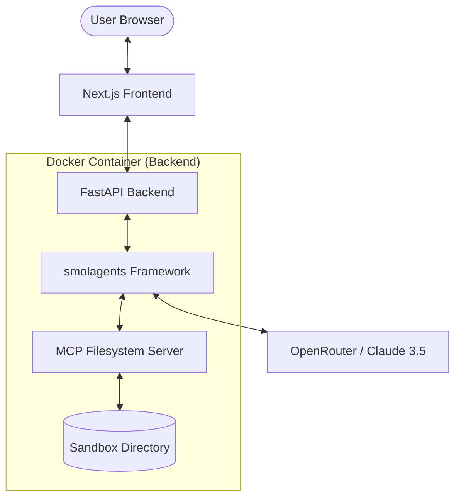

# System Architecture & Framework Documentation

This document explains the technical design, the interaction between components, and the virtualization layer used for local development on macOS.

---

## 🏗 High-Level Architecture

The system follows a modern decoupled architecture:

1.  **Frontend**: A React-based interface (Next.js) that communicates with the backend via REST.
2.  **Backend**: An asynchronous Python API (FastAPI) that manages the AI Agent's lifecycle.
3.  **Agent**: Powered by `smolagents`, it uses the `ToolCallingAgent` pattern to interact with the environment.
4.  **MCP**: Standardizes how the agent accesses the local filesystem, providing a secure, sandboxed bridge.

---

## 🐳 Containerization & Virtualization (macOS + Colima)

### Why Colima?
On macOS, Docker cannot run natively because the Docker Engine requires a Linux kernel. **Colima** provides a lightweight Linux Virtual Machine (using **QEMU**) that runs the Docker daemon.

### The Bridge Architecture
- **Virtualization Layer**: Colima creates a small Linux VM. All Docker containers actually run inside this VM, not directly on macOS.
- **Network Bridging**: When you map port `8000:8000`, Colima routes traffic from your Mac's `localhost` into the Linux VM's internal network, and finally to the container.
- **Volume Mounting (VirtioFS/9p)**: Files in `./backend/sandbox` are synced between your Mac and the Linux VM. The container then mounts these from the VM. This is why we use "Anonymous Volumes" (e.g., `/app/node_modules`) to prevent slow performance or permission conflicts with the host filesystem.

---

## 🧠 Backend Framework: `smolagents`

We use the `smolagents` library by Hugging Face because of its simplicity and "Code-as-Action" philosophy.

### Key Components:
- **`ToolCallingAgent`**: Unlike traditional "ReAct" agents that just output text, this agent generates structured calls to tools.
- **`LiteLLMModel`**: A provider-agnostic wrapper. We use it to connect to **OpenRouter**, allowing us to switch between Claude, GPT-4, or Llama with a single environment variable change.
- **Lifespan Management**: The FastAPI `lifespan` event is used to initialize the MCP server and the Agent exactly once when the server starts, ensuring the `AsyncExitStack` correctly cleans up subprocesses on shutdown.

---

## 📂 Model Context Protocol (MCP)

The **Model Context Protocol** is used to decouple the AI Agent from the specific tools it uses.

### Implementation:
Instead of writing custom Python functions for file management, we launch a **Node.js-based MCP Filesystem Server** as a subprocess inside the Python container.
- **Standardization**: The Agent doesn't care *how* files are listed; it just speaks the MCP protocol.
- **Security**: The MCP server is launched with a `SAFE_DIR` argument (`/app/sandbox`), hard-restricting the agent's "world" to that folder. Even if the LLM is compromised, it cannot escape this directory because the MCP server itself enforces the boundary.

---

## ⚛️ Frontend Framework: Next.js

The frontend is built with **Next.js 15+** and **Turbopack**.

### Features:
- **API Interaction**: Uses a standard `fetch` pattern to send messages to the `/api/chat` endpoint.
- **State Management**: Manages chat history locally to provide the LLM with context for multi-turn conversations.
- **Environment Handling**: Uses `NEXT_PUBLIC_API_URL` to dynamically point to the backend, whether it's running locally on the host or inside a Docker network.

---

## 🛠 Admin Summary
- **Language**: Python 3.11 (Backend), TypeScript/Node 20 (Frontend).
- **Communication**: HTTP/JSON (External), Stdio/JSON-RPC (Internal MCP).
- **Runtime**: Docker (Linux) via Colima (macOS VM).
