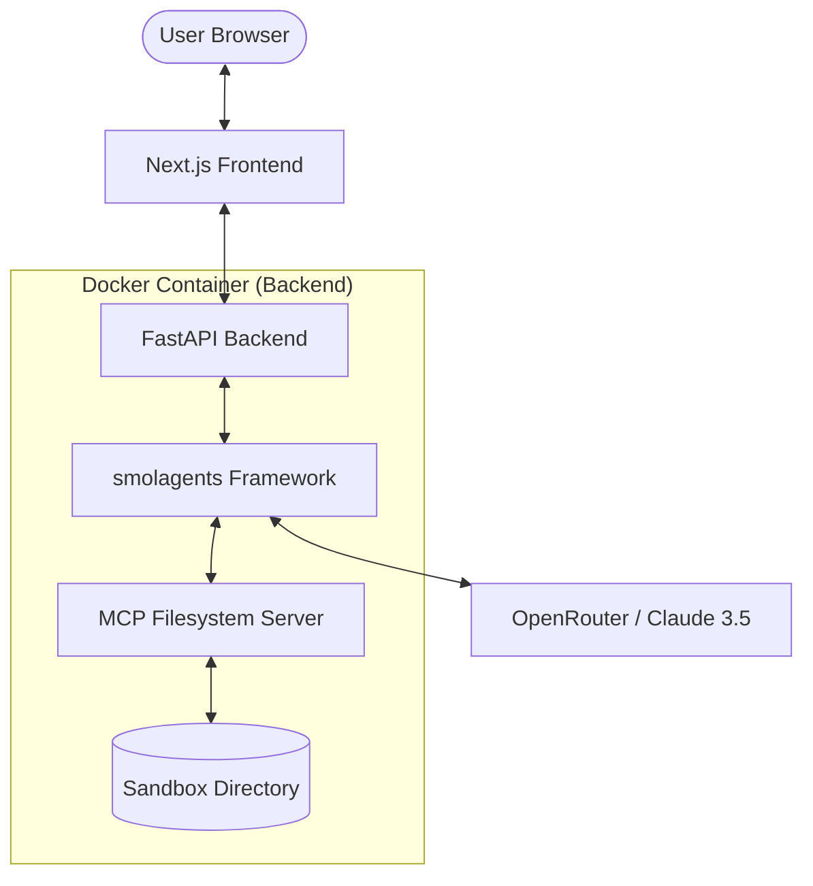

# System Architecture & Framework Documentation

This document explains the technical design, the interaction between components, and the Model Context Protocol (MCP) integration.

---

## 🏗 High-Level Architecture

The system follows a modern decoupled architecture:



1.  **Frontend**: A React-based interface (Next.js) that communicates with the backend via REST.
2.  **Backend**: An asynchronous Python API (FastAPI) that manages the AI Agent's lifecycle.
3.  **Agent**: Powered by `smolagents`, it uses the `ToolCallingAgent` pattern to interact with the environment.
4.  **MCP**: Standardizes how the agent accesses the local filesystem, providing a secure, sandboxed bridge.

---

## 🧠 Backend Framework: `smolagents`

We use the `smolagents` library by Hugging Face because of its simplicity and "Code-as-Action" philosophy.

### Key Components:
- **`ToolCallingAgent`**: Unlike traditional "ReAct" agents that just output text, this agent generates structured calls to tools.
- **`LiteLLMModel`**: A provider-agnostic wrapper. We use it to connect to **OpenRouter**, allowing us to switch models with a single environment variable.

---

## 📂 Model Context Protocol (MCP)

The **Model Context Protocol** is used to decouple the AI Agent from the specific tools it uses.

### Implementation:
The backend uses a dynamic loading mechanism defined in `backend/main.py`. It reads `backend/mcp_servers.json` and initializes each server using the `smolagents` `ToolCollection.from_mcp` method.

### `mcp_servers.json` Structure:
```json
{
  "mcpServers": {
    "server-name": {
      "command": "executable",
      "args": ["arg1", "{{SAFE_DIR}}"],
      "env": { "KEY": "VALUE" }
    }
  }
}
```
- `{{SAFE_DIR}}`: Automatically replaced with the absolute path to `backend/sandbox`.

---

## 🧠 Memory & Reasoning Design

### Core Principle
👉 **Stateless at Runtime**: The agent is only the decision layer.  
👉 **External Memory**: Memory is a shared external service (via MCP), not prompt-based.

### Memory Types
- **Episodic**: Chat history for the current session.
- **Semantic**: Facts about the repository and project.
- **Procedural**: Documentation of how previous tasks were solved.

---

## 🧭 Agent Behavior Model

The agent follows an execution loop:
1. **Context Loading**: Retrieve relevant memory via MCP.
2. **Analysis**: Understand repo context using Filesystem/Git tools.
3. **Planning**: Generate an implicit plan for the task.
4. **Execution**: Execute tools sequentially (Code Analysis, Git, Sandbox).
5. **Validation**: Verify results (Run tests/app).
6. **Persistence**: Commit changes via Git MCP and store summary in Memory MCP.

---

## 🔐 Sandbox & Safety

### Sandbox Structure
```text
sandbox/
  ├── repos/          # Cloned repositories
  ├── apps/           # Generated applications
  └── runtime_logs/   # Execution logs
```

### Safety Constraints
- **Strict Isolation**: No access outside the `/app/sandbox` directory.
- **Tool-Only Access**: All filesystem operations MUST go through MCP tools.
- **Non-Root**: All processes run as a non-privileged `appuser`.

---

## 🛠 Extension Guide: Adding New Tools

To add a new capability (e.g., Git, SQLite):
1. Find an MCP server or write your own.
2. Add it to `backend/mcp_servers.json`.
3. Restart the backend and verify the logs for `✓ Loaded tools from [server]`.

---
*Generated by Gemini CLI - May 2026*
