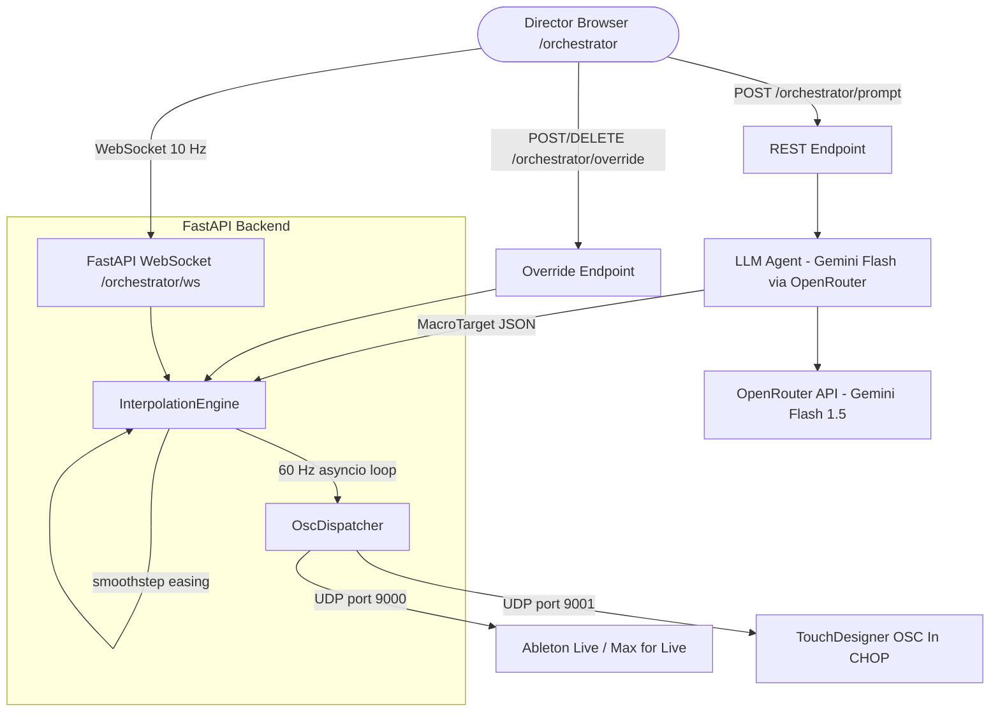

# Orchestrator Architecture

This document describes the **Real-Time Show Orchestrator** — a live performance control system built on top of the AI Agent boilerplate.

---

## Overview

The orchestrator allows a director to steer the technical and emotional state of a live show in real time. A semantic text prompt is translated by an LLM into:
- **7 Numeric Macros**: Smoothly interpolated values (0.0–1.0) controlling SPECTRAL and RHYTHMIC density.
- **2 String Macros**: Expressive descriptions for VIBE and SCENE context.

Targets are broadcast via OSC at 60 Hz to Ableton Live and TouchDesigner.

---

## Architecture



---

## Show Agent Logic (The Pipeline)

The system operates through a **Think-Interpolate-Dispatch** pipeline:

### 1. The "Think" Phase (LLM Translation)
When you provide a prompt like *"Build tension slowly towards a cinematic climax,"* the **LLM Agent** performs a semantic mapping.
- **Dynamic Prompting:** The agent's system prompt is built dynamically from `config.py`, ensuring it knows about all current variables and their descriptions.
- **Output:** It determines precise values (0.0–1.0) for macros and suggests expressive strings like a `vibe` ("Cinematic") and a `scene_description`.

### 2. The "Interpolate" Phase (60 Hz Engine)
The **Interpolation Engine** is the heartbeat of the system.
- **Smoothness:** It runs a 60 Hz loop that smoothly "slides" the numeric values toward the target using a **smoothstep** easing function.
- **Immediate Strings:** Unlike numeric values, string macros (Vibe/Scene) are updated instantly to provide immediate semantic context.
- **Overrides:** Handles manual "pins" from the UI, pulling specific variables out of the automated loop for manual control.

### 3. The "Act" Phase (OSC Dispatch)
The **OSC Dispatcher** takes the "live" values calculated by the engine and broadcasts them via UDP.
- **Protocol:** Uses industry-standard OSC, multi-casting to both Music (Ableton) and Visual (TouchDesigner) systems simultaneously.

---

## Components

### Backend (`backend/orchestrator/`)

| Module | Responsibility |
|---|---|
| `config.py` | **Central source of truth.** Defines all numeric/string macro fields and their descriptions. |
| `models.py` | Pydantic schemas: `MacroState`, `MacroTarget`, `PromptRequest`, `OverrideRequest`, `CalibrationRequest`, `OrchestratorStatus`. |
| `llm_agent.py` | Translates semantic prompts into `MacroTarget` using LiteLLM. System prompt is injected dynamically from `config.py`. |
| `interpolation_engine.py` | 60 Hz asyncio loop. Smoothstep easing for numeric fields; immediate updates for strings. |
| `osc_dispatcher.py` | UDP client pair. Iterates through all fields in `config.py` to broadcast OSC messages. |
| `router.py` | FastAPI `APIRouter`. REST + WebSocket endpoints. |

### Frontend (`frontend/app/orchestrator/`, `frontend/components/orchestrator/`)

| File | Responsibility |
|---|---|
| `page.tsx` | Director console. Displays **Expression Zone** (Vibe/Scene) + 7 Numeric Gauges + Overrides. |
| `MacroGauge.tsx` | Animated horizontal gauge for numeric macros. |
| `OverrideSlider.tsx` | Range slider for manual override. |
| `PresetBank.tsx` | Save/load named macro snapshots (updated for all 7 numeric fields). |

---

## OSC Messages

Sent to both targets on every 60 Hz tick:

| Address | Type | Description |
|---|---|---|
| `/orchestrator/energy` | `float` | Overall intensity |
| `/orchestrator/tension` | `float` | Buildup/harmonic tension |
| `/orchestrator/rhythm_density` | `float` | Percussive complexity |
| `/orchestrator/atmosphere` | `float` | Reverb/textural space |
| `/orchestrator/brightness` | `float` | Spectral high-frequency content |
| `/orchestrator/industrial` | `float` | Distortion/mechanical texture |
| `/orchestrator/glitch` | `float` | Stutter/artifact intensity |
| `/orchestrator/vibe` | `string` | One-word vibe descriptor |
| `/orchestrator/scene_description` | `string` | Short expressive scene text |

---

---

## API Endpoints

| Method | Path | Description |
|--------|------|-------------|
| `GET` | `/orchestrator/status` | Current `OrchestratorStatus` snapshot |
| `POST` | `/orchestrator/prompt` | Translate prompt via LLM → set target, returns `MacroTarget` |
| `POST` | `/orchestrator/override` | Pin a field `{ field, value }` to a manual value |
| `DELETE` | `/orchestrator/override/{field}` | Release a pinned field |
| `POST` | `/orchestrator/calibrate` | Adjust per-macro output clamping ranges |
| `WebSocket` | `/orchestrator/ws` | Stream `OrchestratorStatus` at 10 Hz |

---

## Environment Variables

Add to `backend/.env`:

```dotenv
# Orchestrator LLM (defaults to Gemini Flash via OpenRouter)
ORCHESTRATOR_MODEL_ID=openrouter/google/gemini-3.1-flash-lite

# OSC Targets (defaults shown)
ABLETON_OSC_HOST=127.0.0.1
ABLETON_OSC_PORT=9000
TD_OSC_HOST=127.0.0.1
TD_OSC_PORT=9001
```

---

## Design Decisions

| Decision | Rationale |
|---|---|
| Single backend router, no new service | Reuses existing FastAPI lifespan, LiteLLM, and CORS config. No new Docker service needed. |
| `litellm.completion()` directly (not `LiteLLMModel`) | `LiteLLMModel` is a `smolagents` wrapper requiring a tool-calling loop. For a single structured JSON completion, `litellm.completion()` with `response_format=json_object` is simpler and more reliable. |
| 60 Hz asyncio loop | Fully async FastAPI; avoids GIL contention. `asyncio.sleep(1/60)` prevents drift; actual elapsed time tracked with `time.monotonic()`. |
| WebSocket at 10 Hz (not 60 Hz) | Browser animations don't need 60 Hz; 10 Hz saves bandwidth. OSC dispatch stays at 60 Hz. |
| Smoothstep easing `t²(3-2t)` | Simple, no external deps, visually pleasing. Linear fallback for snap transitions (`duration < 0.5s`). |
| Override pin/release as `dict[str, float]` | All access is from the asyncio event loop (async router handlers). No lock needed. |
| `localStorage` for presets | Keeps the system stateless between sessions; no backend DB needed. |
| Separate OSC ports for Ableton / TD | Allows independent routing; hardware can run on different LAN machines. |

---

## Deployment Notes

- `python-osc` is a new dependency — requires a Docker container rebuild: `docker-compose up --build backend`.
- New files under `backend/orchestrator/` are picked up immediately by the existing `./backend:/app` volume mount without rebuilding.
- OSC packets are fire-and-forget (UDP). If Ableton/TD aren't running, no exception is raised. The startup log line confirms configured addresses.
- WebSocket does not go through FastAPI's CORS middleware — this is correct behavior and requires no configuration.

---

## Testing

- **Unit**: `pytest` tests for `InterpolationEngine` step math (`smoothstep`, `lerp`) and easing curve correctness.
- **Integration**: Mock LLM returning a known `MacroTarget`; assert OSC packet content via a UDP listener on loopback.
- **Hardware**: Use `oscdump 9000` and `oscdump 9001` to verify 60 Hz output independently of Ableton/TD.
- **Frontend**: Rehearsal panel OSC monitor displays last 30 frames at 10 Hz for visual verification.

---

*Implemented May 2026*
